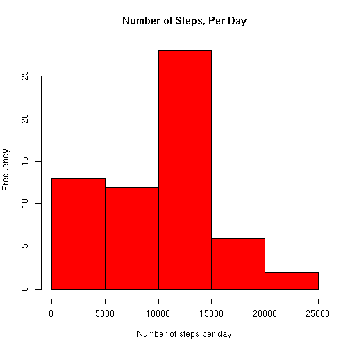
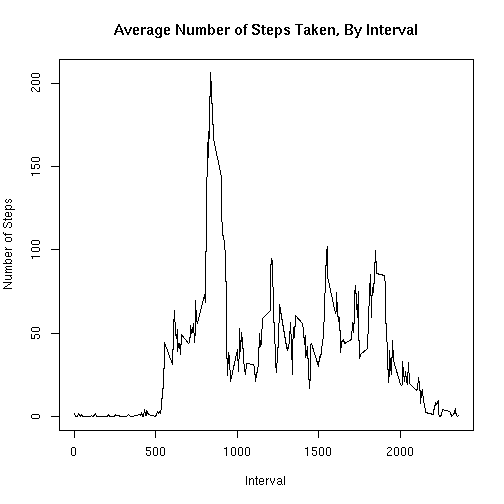
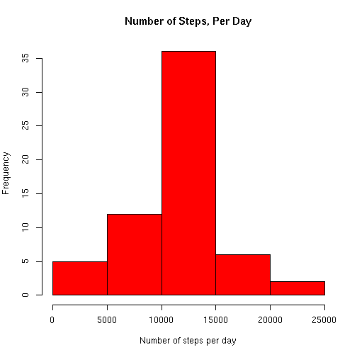
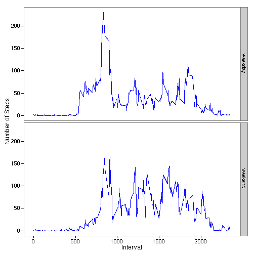

# Reproducible Research: Peer Assessment 1

## Introduction
This report examines activity monitoring data for a single, anonymous
individual over the course of two months (October and November) in 2012.

The data was collected at five-minute intervals over the course of the entire
day.

## Loading and preprocessing the data
First, a couple of needed libraries are loaded.

```r
library(plyr)
library(ggplot2)
```
The data is contained in a zipped file named *activity.zip*.  This file
is unzipped to *activity.csv*, and then read in. The file contains over 17000
rows of three columns:
- **steps**: Number of steps taken in a 5-minute interval, with missing values coded as **NA**.
- **date**: Date on which the measurement was taken
- **interval** The identifier for the 5-minute interval during which the 
measurement was taken.  These range from 0 to 2355, and correspond to the time
of day (e.g., 0 being midnight, 0630 for 6:30 a.m., and 2040 for 8:40 p.m.).

The **date** field is then converted from a character string to a Date object
to facilitate later processing. 

(**N.B.** the stringsAsFactors option was set to FALSE in the *read* function 
so the **date** field wouldn't be read as a factor.)

```r
# Read in the data.  Set stringsAsFactors to be false to be able to transform
# the date strings into date objects
stepData<-read.csv(unz("activity.zip","activity.csv"),stringsAsFactors=FALSE)

# Convert the date strings into Date objects
stepData$date<-as.Date(stepData$date,"%Y-%m-%d")
```

## What is mean total number of steps taken per day?
First, we are interested in the total number of steps taken per day.  So,
the *step* data is first aggregated by date.  Note that any missing values
are simply ignored.

A histogram is created next, and it appears that 10000 - 15000 steps/per day
is the most common range.

```r
# Sum up the total steps per day, to create the histogram
stepHist<-aggregate(list(Steps=stepData$steps),by=list(Date=stepData$date),
                    sum,na.rm=TRUE)
hist(stepHist$Steps,xlab="Number of steps per day",col="red",
                          main="Number of Steps, Per Day")
```

 

For a more precise measurement of the number of steps per day, the mean
and median are calculated:

```r
# Calculate/report the mean and median total number of steps per day
mean(stepHist$Steps)
```

```
## [1] 9354
```

```r
median(stepHist$Steps)
```

```
## [1] 10395
```
As shown by the R output, the **mean** is 9354, and the **median** is 10395.

## What is the average daily activity pattern?
We were next interested in what the average daily activity pattern would 
look like. 

To answer the question, a time-series plot was created using the average
number of steps taken, averaged over all days. This required first
aggregating and averaging the steps over each interval. Again, any missing
data is ignored.  The result is plotted
below.

```r
#Aggregate the step data by interval, taking the mean for each interval
meanByInterval<-aggregate(list(Steps=stepData$steps),
                          list(Interval=stepData$interval),mean,na.rm=TRUE)
# Plot
plot(meanByInterval$Interval,meanByInterval$Steps,type="l",xlab="Interval",
     ylab="Number of Steps",main="Average Number of Steps Taken, By Interval")
```

 

Daily activity begins around 5 a.m., and increases to a daily maximum over 
200 in the morning before 10 a.m. The remainder of the day follows a jagged
curve, but generally ranging between 25 and 100 steps.  This activity falls
off around 8:00 p.m., trending towards 0 as the evening progresses.

Being more precise about the maximum:

```r
# Find the 5-minute interval which on average contains the maximum number of steps
# First find the index where the maximum occur
maxIndex<-which.max(meanByInterval$Steps)
# Then access that row
meanByInterval[maxIndex,]
```

```
##     Interval Steps
## 104      835 206.2
```
This shows that, on average, the maximum number of steps is 206, and occurs
at 8:35 a.m.

## Imputing missing values
As the missing values may introduce some bias, it may be useful to determine
how many values are actually missing:

```r
missing<-which(is.na(stepData$steps))
length(missing)
```

```
## [1] 2304
```
As indicated in the R output, there are 2304 missing values.  It may be useful
to impute these missing values.  The strategy chosen to fill in for the missing
data was simply to take the mean for each interval, and apply the specific 
interval's mean to any identical interval missing a value. A new dataframe
containing the imputed data in place of the NAs is then used to create
a step histogram.

```r
# Create function to use mean of the 5-minute interval to fill in the NAs
imputedMean<-function(x) replace(x, is.na(x),mean(x, na.rm=TRUE))
# Create new dataframe with imputed data
# Use ddply to split the data by interval, and call the imputedMean function
# to fill in any missing data
imputedStepData<-ddply(stepData, ~interval, transform, steps=imputedMean(steps))

# Using the new dataframe, aggregate the step data by interval
imputedStepHist<-aggregate(list(Steps=imputedStepData$steps),
                       list(Date=imputedStepData$date),sum,na.rm=TRUE)
# Now create the plot based on the dataframe with the additional imputed data
hist(imputedStepHist$Steps,xlab="Number of steps per day",col="red",
                       main="Number of Steps, Per Day")
```

 

Compared with the first histogram (without imputed data), the shape is basically
the same, but there are some important differences.  The same range 
(10000-15000) is still the most frequent, but its frequency has noticeably
increased.  At the same time, the frequency for the first bin (range 0 - 5000) 
has noticeably decreased.  Looking at the mean and median for the imputed
data set:

```r
# Calculate/report the mean and median total number of steps per day
mean(imputedStepHist$Steps)
```

```
## [1] 10766
```

```r
median(imputedStepHist$Steps)
```

```
## [1] 10766
```
As indicated, the **mean** is 10766, and the **median** is also 10766. 
This differs from the mean (9354) and median (10395) of the original 
data set where the missing data was simply ignored.  So, the imputed 
data mean is significantly higher by over 1400 steps.  The imputed 
data median is also higher, but only by 371 steps.

## Are there differences in activity patterns between weekdays and weekends?
Using the imputed data set, are there any differences between activity during
weekdays and the weekends?  Answering this question required adding a new
factor variable to the data set. The added factor variable has two levels, 
*weekend* and *weekday*.  Each case's factor was set by using the case's date
to determine the day of the week, with dates corresponding to days Monday-Friday
set to *weekday* and dates corresponding to Saturday or Sunday set to *weekend*.

After adding the factor, the step data was aggregated by interval and the new
factor variable.  This aggregated step data was then plotted, conditioned
on the weekday/weekend factor variable.

```r
# Set up a "weekend" vector to use in a test for the weekday
weekend<-c('Saturday','Sunday')
#First, add a new column
imputedStepData$daycat<-factor(with(isd,ifelse ((weekdays(as.Date(date))
                               %in% weekend),"weekend","weekday")))
daycat.agg<-aggregate(list(Steps=imputedStepData$steps),
                        by=list(Interval=imputedStepData$interval,
                            Category=imputedStepData$daycat),mean,na.rm=TRUE)

p<-ggplot(daycat.agg,aes(Interval,Steps)) + theme_bw()
p<-p+ theme(panel.grid.major = element_blank(), panel.grid.minor = element_blank())
p<-p+geom_line(color="blue") + labs(x="Interval",y="Number of Steps") + facet_grid(Category ~.)
print(p)
```

 

Looking at the plots, one can see that the activity patterns between weekdays
and weekends are different.  Activity levels start later and ramp up more slowly
on the weekends.  The weekend activity peak is lower than the weekday peak,
but weekends appear more active generally. The end-of-day activity levels
appear roughly comparable.
